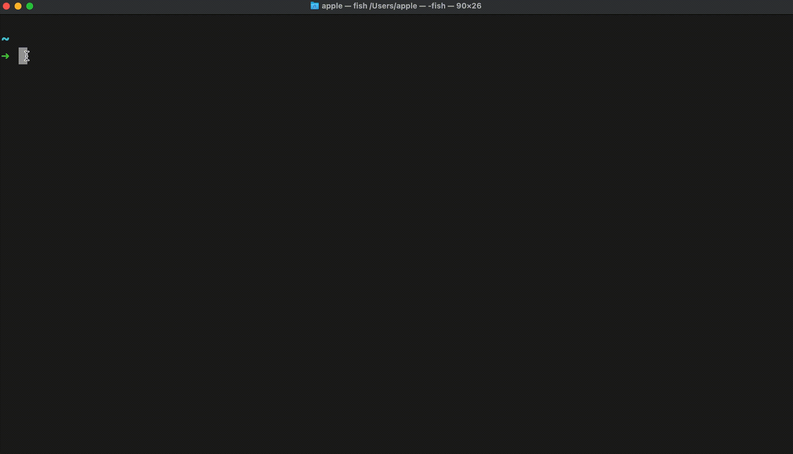

assemble-avengers
=================

A dead simple cli tool to arrange a google meet call and send the link to telegram group.

<!-- toc -->
* [Usage](#usage)
* [Commands](#commands)
<!-- tocstop -->
# Usage
> Name changed now its assemble-avengers.



<!-- usage -->
```sh-session
$ npm install -g assemble-avengers
$ assemble-avengers now
You are about to be taken to telegram site, follow the steps there and copy your api-id and api-hash....
$ assemble-avengers (-v|--version|version)
v1.0.10
$ assemble-avengers --help [COMMAND]
Options:
  -V, --version   output the version number
  -h, --help      display help for command

Commands:
  now             Risky command you are about to send a BOLO for all avengers registered with S.H.I.E.L.D
  reset           Resets all congfig.
  help [command]  display help for command
  
$ assemble-avengers reset
"Reseting everything...."
```
<!-- usagestop -->
# Commands
<!-- commands -->
* [`assemble-avengers now`](#assemble-avengers-now)
* [`assemble-avengers help [COMMAND]`](#assemble-avengers-help-command)
* [`assemble-avengers reset`](#assemble-avengers-reset)

## `assemble-avengers now`

Initialize the cli. Just follow the simple steps to get you started.

```
USAGE
  $ assemble-avengers now

OPTIONS
  -n, --now=now  gather avengers

EXAMPLE
  $ assemble-avengers now
```

## `assemble-avengers help [COMMAND]`

Check all available commands.

```
USAGE
  $ assemble-avengers help [COMMAND]

ARGUMENTS
  COMMAND  command to show help for

OPTIONS
  --all  see all commands in CLI
```

## `assemble-avengers reset`

Resets all your data.

```
USAGE
  $ assemble-avengers reset
```
